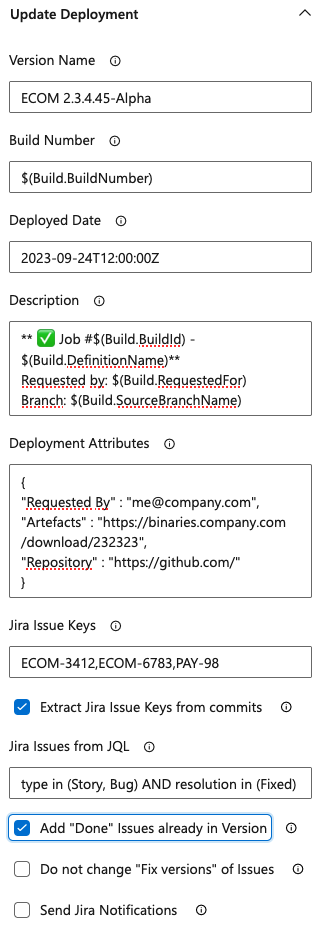
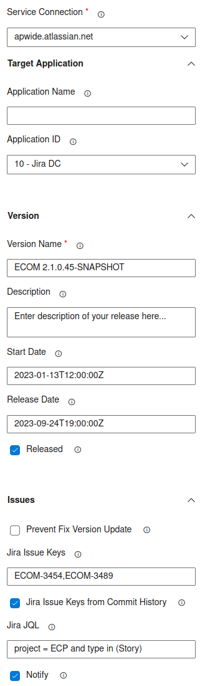

# What is Apwide Golive for Jira?

Apwide Golive is the game-changing solution for comprehensive test environment management.

Seamlessly integrated with your development and release processes, Apwide Golive empowers your teams to
deliver high-quality software with speed and confidence.
Apwide Golive provides a centralized dashboard for visualizing and tracking environment usage, resource allocation, and availability right in Jira.

With integrated notifications and approvals in Jira, stakeholders stay informed and can provide quick feedback, reducing delays and accelerating the testing
process.

Learn more about Apwide Golive: https://www.apwide.com

# Benefits of the Apwide Golive Azure DevOps Marketplace Extension

With the Apwide Golive and Azure extension, you can leverage the robust capabilities of Azure DevOps and combine them with the comprehensive test environment
management features of Apwide Golive for Jira.

This integration enables you to easily connect your Azure DevOps projects with Apwide Golive. Deployments and relevant environment information required by testers, release managers,... and other teams,
are automatically pushed to Apwide Golive and Jira from your Azure DevOps pipelines.

Learn more about why it is important to track information of your environment [here](https://golive.apwide.com/doc/latest/cloud/track-your-environments)

# Connect your Azure Project with Golive

Go to your Project Settings/Service Connections to connect to different instances of Golive:


Follow instructions to properly configure and verify your connection parameters:


# Add custom Golive tasks to your pipelines

You can configure new tasks to your pipelines with the graphical assistant:


The graphical assistant can also be used in “Release” pipelines:


# Apwide Golive Environment pipeline task

Use this task to push any environment information (ex: deployment, status, configuration,...) to Golive when your pipelines are changing your environments.

This is your “swiss knife” task to track your environments managed in Azure DevOps.

## Configure a new task using the graphical assistant

### Select the connection and specify the target Golive environment
After having selected the Service Connection to connect with your Golive server, you have to identify the environment you want to update in Golive.

#### Automatically create target environment (if missing in Golive)
Select “auto create” option if you want to automatically create the environment based on the provided names if it does not exist yet in Golive:


#### Push information to an existing target environment
In order, to use an existing environment as target, simply let the “Environment Name” parameter empty and search for the Golive environment in the picker list:


### Push deployment information
If your pipeline is performing deployments, you can send the information of the performed deployment to Golive. All deployment information to push to Golive are set in the “Update Deployment” section:



Check the help information of each option in order to understand how to use it.

For the "Extract Jira Issue Keys from commits" option enables the parsing of commit messages to identify the issue keys that should be added to the deployment.

The task employs several strategies to extract issue keys from a build:
* It traverses the messages of all changes that are part of a build. By default, Azure returns all changes since the last successful build, and consequently,
  Golive will iterate through all of these. However, Azure truncates messages, and only the first commit line will be analyzed.
* It queries the Azure Git Rest API to retrieve all commits since the last successful build. This only works for Git repositories hosted on Azure.
* It traverses commits using the git CLI from the agent image. By default, when no checkout step is specified, [Azure performs a shallow checkout](https://learn.microsoft.com/en-us/azure/devops/pipelines/yaml-schema/steps-checkout?view=azure-pipelines#shallow-fetch), 
  and the history is not available. To make it available, it is necessary to define a checkout step with a depth of 0:

```yaml
steps:
  - checkout: self
    fetchDepth: 0
```

There are plenty of other options available that will drastically help you automate routines to simplify your pipelines.

### Update Environment Status
If you want to update the status of the Golive environment (ex: when starting a deployment, after a deployment has been performed,…), open the “Update Status” section. Pick the desired status or type its name:


### Update Environment url and attributes
You can update and share other useful environment information managed by Azure DevOps pipelines in the “Update Environment” section.


## Configure a task using YAML
When working with yaml pipelines, the graphical assistant will generate yaml code that you can edit an re-use in other pipelines or in templates of pipeline.

Example of generated yaml:

```yaml
- task: ApwideGoliveSendEnvironmentInfos@2
  inputs:
    serviceConnection: 'apwide.atlassian.net'
    targetEnvironmentName: 'eCommerce Demo'
    targetEnvironmentAutoCreate: true
    targetApplicationName: 'eCommerce'
    targetApplicationAutoCreate: true
    targetCategoryName: 'Demo'
    targetCategoryAutoCreate: true
    deploymentVersionName: 'ECOM 2.3.4.45-Alpha'
    deploymentBuildNumber: '$(Build.BuildNumber)'
    deploymentDeployedDate: '2023-09-24T12:00:00Z'
    deploymentDescription: |
      ** ✅ Job #$(Build.BuildId) - $(Build.DefinitionName)**
      Requested by: $(Build.RequestedFor)
      Branch: $(Build.SourceBranchName)
    deploymentAttributes: |
      {
      "Requested By" : "me@company.com",
      "Artefacts" : "https://binaries.company.com/download/232323",
      "Repository" : "https://github.com/"
      }
    deploymentIssueKeys: 'ECOM-3412,ECOM-6783,PAY-98'
    deploymentIssueKeysFromCommitHistory: true
    deploymentIssuesFromJql: 'project = ECOM and type in (Story, Bug) AND resolution in (Fixed)'
    deploymentAddDoneIssuesOfJiraVersion: true
    deploymentNoFixVersionUpdate: false
    deploymentSendJiraNotification: false
    environmentStatusName: 'Up'
    environmentUrl: 'https://ecommerce.staging.company.com'
    environmentAttributes: |
      {
      "OS" : "Linux Ubuntu",
      "Location":"Switzerland",
      "Owner":"me@company.com"
      }
```

# Send Release Information Task

Use this task to automatically keep your Jira versions/releases up to date when your pipelines are building/releasing new version of a Golive application.
Depending on the Jira project(s) associated to each of your application in Golive, this task will automatically:
* create the Jira versions in the right Jira projects
* update the information of the Jira versions (start/release dates, description, status,...)
* add Jira issues to the Jira version using different strategies (eg: static issue keys, JQL, commits parsing)

## Graphical assistant configuration



Check the help information of each option in order to understand how to use it.

For example, the "Extract Jira Issue Keys from commits" option enables the parsing of commit messages to identify the issue keys that should be added to the jira version/release.
The task will go through all commits made from the current job to the last successful job.

There are plenty of other options available that will drastically help you automate routines to keep your Jira versions/releases up to date.


## YAML configuration

```yaml
- task: ApwideGoliveSendReleaseInfos@1
  inputs:
    serviceConnection: 'apwide.atlassian.net'
    applicationName: 'eCommerce'
    versionName: 'ECOM 2.0.1.1'
    versionDescription: 'Ecommerce candidate release'
    versionStartDate: '2023-09-24T12:00:00Z'
    versionReleaseDate: '2023-10-24T12:00:00Z'
    versionReleased: true
    issueKeys: 'ECOM-3412,PAY-102,ECOM-9986'
    issueKeysFromCommitHistory: true
    issuesFromJql: 'project = ECOM and type in (Story, Bug) AND resolution in (Fixed)'
    sendJiraNotification: false
```

# Contact us

Documentation of common examples of use cases using this extension is available here:
* for Apwide Golive Cloud: https://golive.apwide.com/doc/latest/cloud/azure-devops-tfs-vsts
* for Apwide Golive for Jira Server / Data Center: https://golive.apwide.com/doc/latest/server-data-center/azure-devops-tfs-vsts

We are at your disposal if you have question or need support regarding Apwide Golive and this integration with Azure DevOps: https://www.apwide.com/support-documentation/


