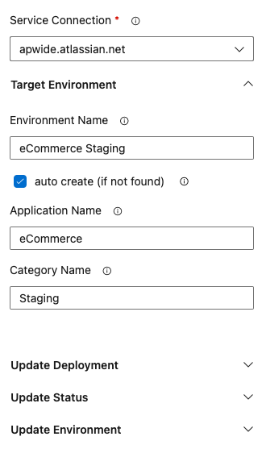
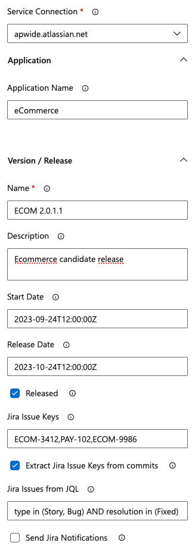

# What is Apwide Golive for Jira?

Apwide Golive is the game-changing solution for comprehensive test environment management.

Seamlessly integrated with your development and release processes, Apwide Golive empowers your teams to
deliver high-quality software with speed and confidence.
Apwide Golive provides a centralized dashboard for visualizing and tracking environment usage, resource allocation, and availability right in Jira.

With integrated notifications and approvals in Jira, stakeholders stay informed and can provide quick feedback, reducing delays and accelerating the testing
process.

Learn more about Apwide Golive: https://www.apwide.com

# Benefits of the Apwide Golive Azure DevOps Marketplace Extension

With the Apwide Golive and Azure extension, you can leverage the robust capabilities of Azure DevOps and combine them with the comprehensive test environment
management features of Apwide Golive for Jira.

This integration enables you to easily connect your Azure DevOps projects with Apwide Golive. Deployments and relevant environment information required by testers, release managers,... and other teams,
are automatically pushed to Apwide Golive from your Azure DevOps pipelines.

# Connect your Azure Project with Golive

Go to your Project Settings/Service Connections to connect to different instances of Golive:


Follow instructions to properly configure and verify your connection parameters:


# Add custom Golive tasks to your pipelines

You can configure new tasks to your pipelines with the graphical assistant:


The graphical assistant can also be used in “Release” pipelines:


# Apwide Golive Environment pipeline task

Use this task when your need to update deployment or to push any other information of your environments to Golive and Jira.

This is your “swiss knife” task to track your environments managed in Azure DevOps.

## Configure a new task using the graphical assistant

### Select the connection and specify the target Golive environment
After having selected the Servie Connection to connect with your Golive server, you have to identify the environment you want to update in Golive.

#### Automatically create target environment (if missing in Golive)
Select “auto create” option if you want to automatically create the environment based on the provided names if it does not exist yet in Golive:



#### Push information to an existing target environment
In order, to use an existing environment as target, simply let the “Environment Name” parameter empty and search for the Golive environment in the picker list:


### Push deployment information
If your pipeline is performing deployments, you can send the information of the performed deployment to Golive. All deployment information to push to Golive are set in the “Update Deployment” section:


The "Jira Issue Keys from Commit History" option enables the parsing of commit messages to identify the issue keys that should be added to the deployment.
The task will go through all commits made from the current job to the last successful job.

### Update Environment Status
If you want to update the status of the Golive environment (ex: when starting a deployment, after a deployment has been performed,…), open the “Update Status” section. Pick the desired status or type its name:


### Update Environment url and attributes
You can update and share other useful environment information managed by Azure DevOps pipelines in the “Update Environment” section.


## Configure a task using YAML
When working with yaml pipelines, the graphical assistant will generate yaml code that you can edit an re-use in other pipelines or in templates of pipeline.

Example of generated yaml:

```yaml
trigger:
- main

pool:
vmImage: "ubuntu-latest"

steps:
  - task: ApwideGoliveSendEnvironmentInfos@1
    inputs:
      serviceConnection: 'apwide.atlassian.net'
      targetEnvironmentName: 'eCommerce Demo'
      targetAutoCreate: true
      targetApplicationName: 'eCommerce'
      targetCategoryName: 'Demo'
      deploymentVersionName: 'ECOM 2.3.4.34-SNAPSHOT'
      deploymentBuildNumber: '$(Build.BuildNumber)'
      deploymentDeployedDate: '2023-11-15T10:00:00Z'
      deploymentDescription: |
          <b>✅ Job #$(Build.BuildId) - $(Build.DefinitionName)</b>
          Requested by: $(Build.RequestedFor)
          Branch: $(Build.SourceBranchName)
      deploymentAttributes: |
        {
          "Requested By" : "julien@company.com",
          "Artefacts" : "https://julien.company.com/download/232323",
          "Repository" : "https://julien.github.com/"
        }
      deploymentIssueKeys: 'ECOM-3454,ECOM-3489'
      deploymentIssueKeysFromCommitHistory: true
      deploymentIssuesFromJql: 'project = ECOM and type in (Story)'
      deploymentAddDoneIssuesOfJiraVersion: true
      deploymentNoFixVersionUpdate: false
      deploymentSendJiraNotification: false
      environmentStatusId: '1'
      environmentUrl: 'https://ecommerce.staging.company.com'
      environmentAttributes: |
        {
        "OS" : "Linux",
        "Location":"Switzerland",
        "Owner":"me@company.com"
        }
```

# Send Release Information Task

Capture release information about your application and request Golive to push them to your Jira instance.

This task will:
* create/update Jira version with provided information
* compute scope of the release with different available strategies (eg: static issue keys, JQL, commits parsing)
* update fix version of issues selected as part of the scope.

## Graphical assistant configuration



### Target Application
Requires a "Service Connection" to contact Golive and the Golive application currently being released.
Based Golive Application - Jira Project Mapping, Golive will be able to know to which project information
must be sent.

### Version
Describe version information and if it should be created in case it does not exist.
"auto create version" set to "golive config" will rely on Golive application configuration to decide
if version must be created automatically. You can also override it and force the version creation if you
set it to true.

### Scope
Choose which issues are part of the current release. Released version will be set as fix version of
these issues.

Scope can be provided from:
* "Jira Issue Keys": static comma separated list of issue keys to include.
* "Jira Issue Keys from Commit History": the task can parse commits messages between the current job and
the last successful job to extract issue keys.
* "Jira JQL": JQL executed on the Jira instance having Golive installed to.

You can also choose to trigger a Jira notification to issue participants of issues having their fix version updated.

## YAML configuration

```yaml
- task: ApwideGoliveSendReleaseInfos@1
  inputs:
    serviceConnection: 'apwide.atlassian.net'
    applicationId: '10'
    versionName: 'ECOM 2.1.0.45-SNAPSHOT'
    versionDescription: 'Enter description of your release here...'
    versionStartDate: '2023-01-13T12:00:00Z'
    versionReleaseDate: '2023-09-24T19:00:00Z'
    versionReleased: true
    issuesNoFixVersionUpdate: false
    issueKeys: 'ECOM-3454,ECOM-3489'
    issuesFromJql: 'project = ECP and type in (Story)'
    sendJiraNotification: true
    issueKeysFromCommitHistory: true
```

# Contact us

The full documentation of this extension is available here:
* for Apwide Golive Cloud: https://golive.apwide.com/doc/latest/cloud/azure-devops-tfs-vsts
* for Apwide Golive for Jira Server / Data Center: https://golive.apwide.com/doc/latest/server-data-center/azure-devops-tfs-vsts

We are at your disposal if you have question or need support regarding Apwide Golive and this integration with Azure DevOps: https://www.apwide.com/support-documentation/


